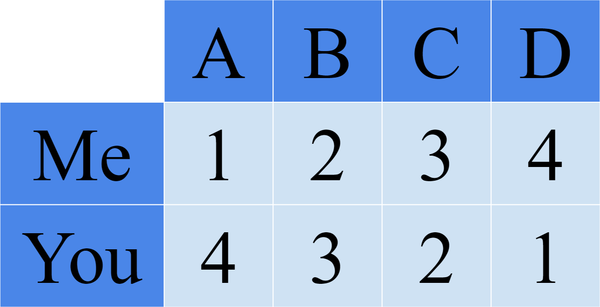
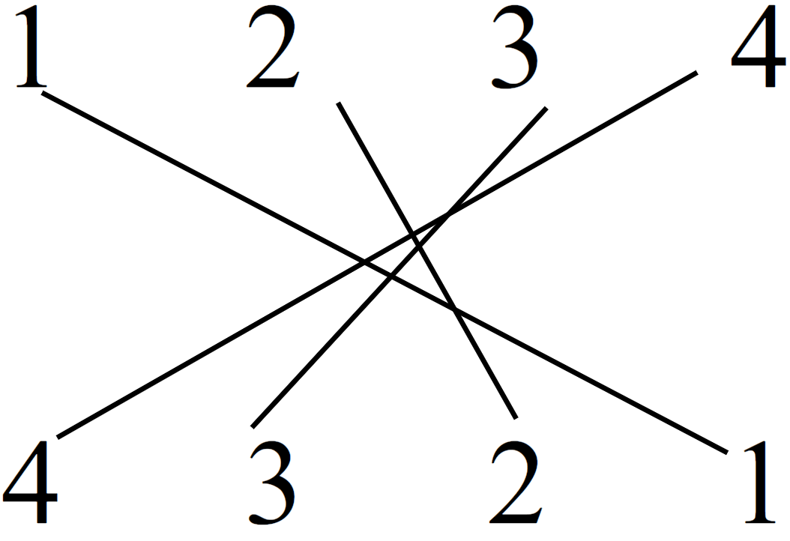
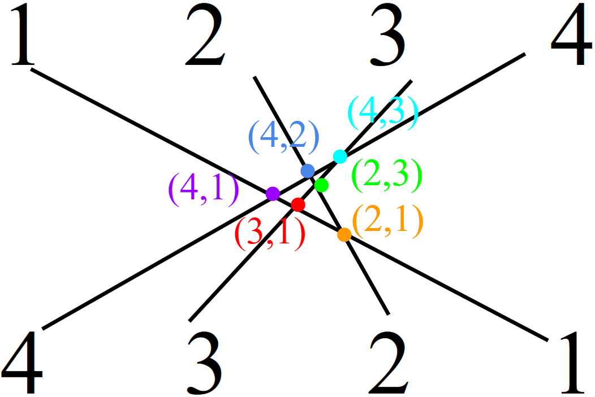
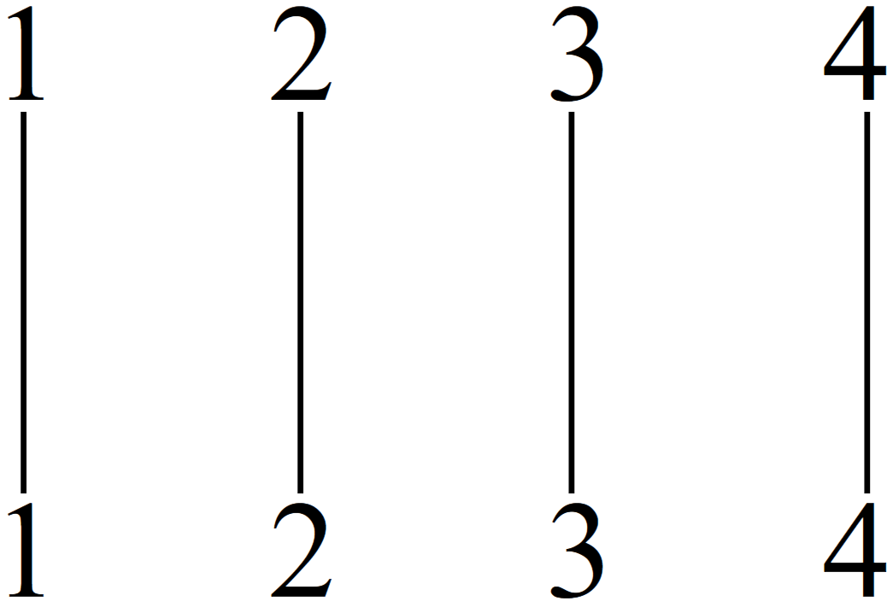
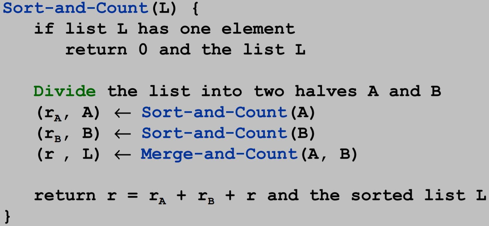
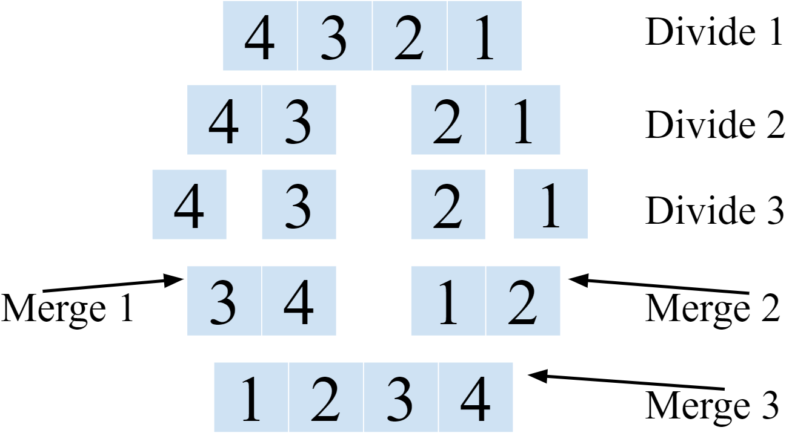

# Counting Inversions
Finds how similar 2 lists of rating are using the Divide and Conquer approach. Extension of MergeSort that actually displays the specific inversions as well as just counting the total number.

## Problem Statement
Compare ratings of n items between 2 lists. How similar are they (how many inversions)?  
1 list is ranked; 1, 2, 3, ... , n  
The other list has arbitrary order: a1, a2, a3, ... , an (values in the array at an index)  
  
**Inversion:** index `i` is less then index `j`, but the value at `i` is greater than the value at `j` (`i` < `j`, but ai > aj)  
**This example has 6 inversions: (4,1), (4,2), (4,3), (3,1), (3,2), (2,1)**

**Use the *array index* as the reference ranking and the *array entry* as the compared ranking**  
To find the number of inversions, we can just write out the 2nd list below the 1st lists which is in sorted order & **draw lines connecting identical values**
  
Now count the number of **times these lines cross** (actual inversions are in colored parentheses)  
  
Again, this example has 6 inversions: (4,1), (4,2), (4,3), (3,1), (3,2), (2,1)

**If a list has no inversions, it is already sorted and no crossed lines**  
  

This reduces down to just comparing the 2nd list to its sorted order

## Solution
Only requires a slight modification to MergeSort  
  
**When merging the 2 sublists, if a value is copied from the right half, then it is greater than all the remaining elements in the left half so the inversion could should increase by the number of elements remaining in the left half**  
**This is a *Split Inversion***  
MergeSort stages:  
  
*In the actual algorithm, the left half happens 1st, but I write both divide steps here for simplicity*  
- In **Merge 1**, the item from the right half (`3`) is copied 1st so we have an inversion (4,3)
- In **Merge 2**, item from the right half (`1`) is copied 1st so we have the inversion (2,1)
- In **Merge 3**, `1` is < both items in the left half so 2 inversions: (3,1) & 4,1)
- Also in **Merge 3**, `2` is < both items in the left half so 2 more inversions: (3,2) & 4,2)

Divide step is the same, but now count the number of inversions in the left half, right half & split inversions  
The Divide stage counts the inversion in the left & right halves, split inversions are counted in the Merge stage

## Runtime
T(n) ≤ T(⌊n/2⌋)+ T(| n/2 |)+ O(n)  
⇒ **T(n) = O(n log n)**  
(by solving the same recurrence relation as MergeSort)

## Code Details
- Return types of the classic mergeSort have been changed to `int` since they now return the number of inversions as well as sorting
- This Algorithm is instance-based instead of a `static` sort method
- The magic happens in the `else` of the `mergeAndCount()` **Main Loop** (this main loop copies the smallest item for a sub-array until 1 sub-array runs out)
  - The `else` is only entered if the item in the left half is NOT smaller than the item in the right half
  - `inversionCount += center-leftPos;` increments `inversionCount` by the number of items remaining in the left half
  - Then a for loop goes from the current `leftPos` until the end of the left half & adds the inversions to a bookkeeping 2D `ArrayList`
    - `inversions.add(new ArrayList<Integer>(Arrays.asList(array[i], array[rightPos-1])));`
      - `array[rightPos-1]` is the item from the right sub-array because a few lines above is: `array[ rightPos++ ];` which increments `rightPos`, so the actual value is 1 less (it's previous value)

## References
- [Counting Inversions - Kevin Wayne](https://www.cs.princeton.edu/~wayne/kleinberg-tardos/pdf/05DivideAndConquerI.pdf#page=12)
- [MergeSort Code - Data Structures and Algorithm Analysis in Java (Third Edition) by Mark Allen Weiss](http://users.cis.fiu.edu/~weiss/dsaajava3/code/Sort.java)
- [Part 1: O(n log n) Algorithm for Counting Inversions - Free Engineering Lectures](https://www.youtube.com/watch?v=4IvYaOY8Pxw)
- [Part 2: O(n log n) Algorithm for Counting Inversions - Free Engineering Lectures](https://www.youtube.com/watch?v=PLkuid82dbc)
- [Count Inversions - GeeksForGeeks](http://www.geeksforgeeks.org/counting-inversions/)  
Changed specific implementation of `inversionCount`
- [Counting inversions - toto2 (Stack Overflow)](https://codereview.stackexchange.com/q/54756)  
Helped figure out Left Boundary & test cases
